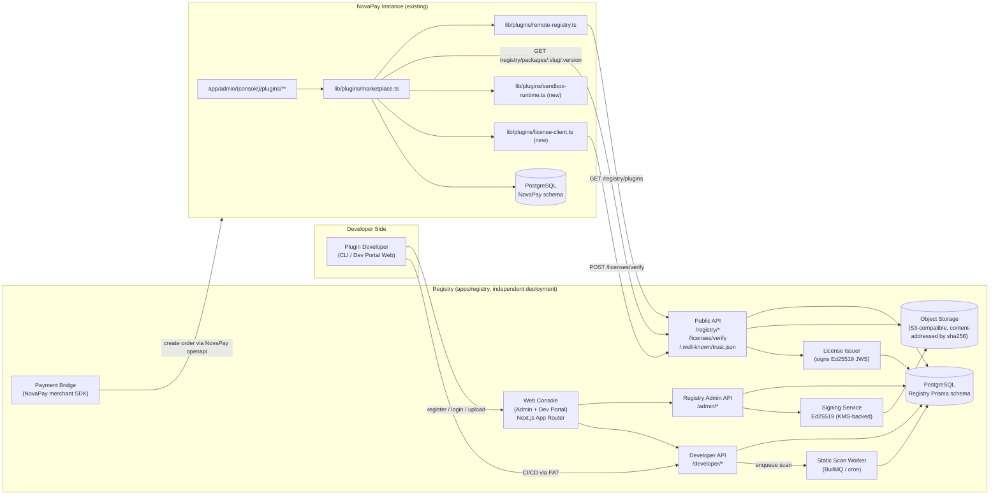
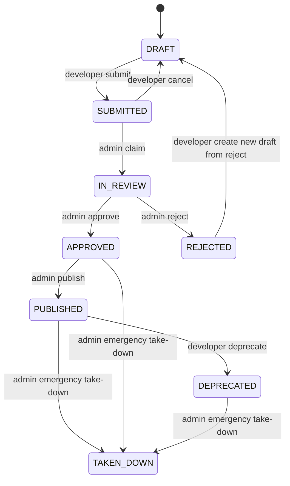
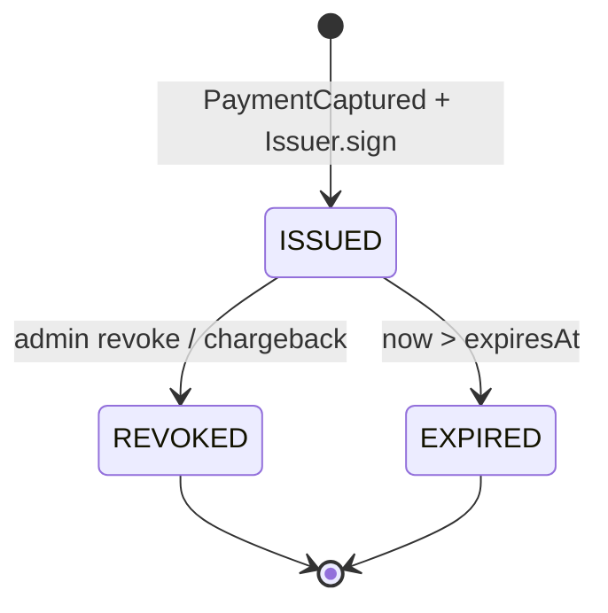
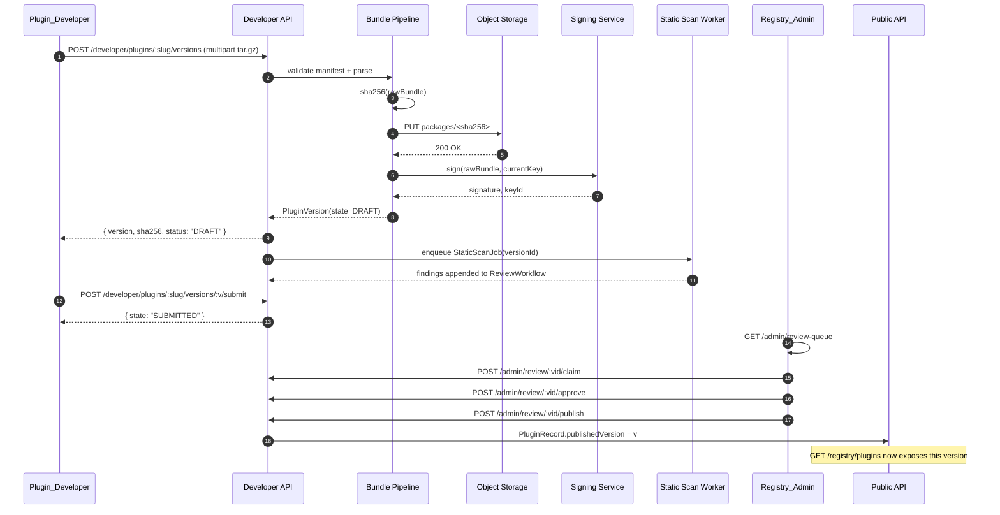
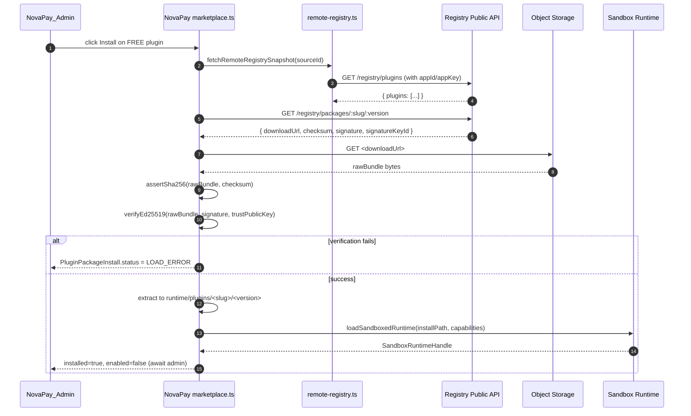
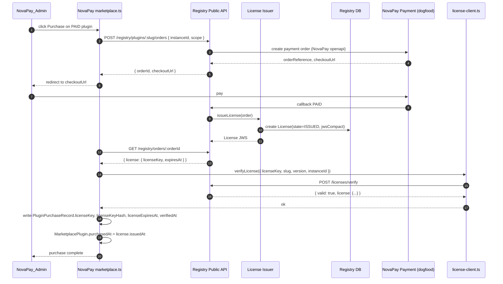
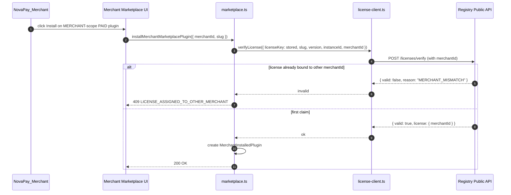
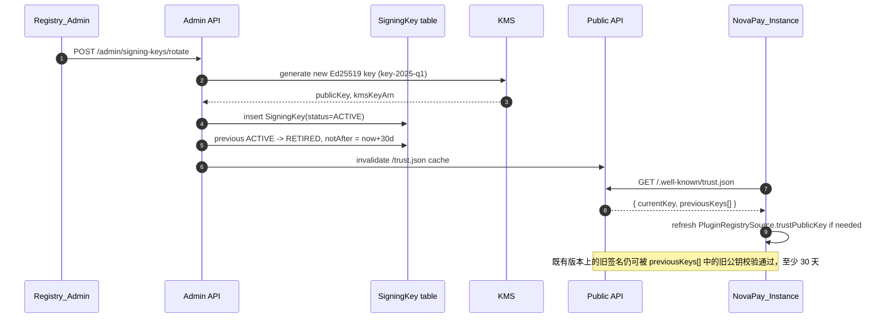

# 设计文档（Design Document）

## Overview

本设计在不破坏 NovaPay 主程序现有插件契约（`lib/plugins/remote-registry.ts` 中的 `parseRemotePluginRecord`、`lib/plugins/local-package-manifests.ts` 中的 `parsePluginPackageManifest`、以及 `prisma/schema.prisma` 中的 `PluginRegistrySource / MarketplacePlugin / PluginPackageInstall / PluginPurchaseRecord / MerchantInstalledPlugin`）的前提下，引入一个**独立部署**的远程插件市场（Remote Plugin Marketplace，下称 Registry），并对 NovaPay 主程序消费侧做最小但关键的改造（验签、License 校验、`worker_threads` 沙箱）。

整体形态：

- **Registry 端**：一套独立的 Next.js + Prisma + PostgreSQL 服务，作为 monorepo 子目录 `apps/registry/` 部署。包含 Registry Admin 控制台、Developer Portal、对外公共 API、对象存储、签名服务、License 服务、静态扫描后台任务。Registry 自己也消费 NovaPay 完成付费插件的收款（dogfooding）。
- **NovaPay 主程序端**：扩展 `PluginRegistrySource` 增加 trust / license 公钥，把 `lib/plugins/marketplace.ts` 中目前手动 `purchasedAt` 标记替换为真实的 License 验证；把 `lib/plugins/local-package-runtimes.ts` 当前的 `new Function("specifier", "return import(specifier);")` 在 `REMOTE_SIGNED` 来源下替换为基于 `worker_threads` 的沙箱。
- **兼容策略**：阶段 1 上线时，Registry 的 `GET /registry/plugins`、`GET /registry/packages/:slug/:version` 必须与 `app/api/mock-plugin-registry/**` 当前返回的 JSON 字段集合**逐字段一致**，使得 NovaPay 实例只需把 `PluginRegistrySource.baseUrl` 切到新的 Registry 即可，无需修改任何解析代码（满足 Req 23 / Req 25.2 / Req 25.3）。

下文所有 Chinese 描述使用中文，所有标识符（Prisma 模型、字段、API 路径、错误码、枚举值、目录名、代码片段）保持英文。

## Architecture

### High-level topology



### 关键设计抉择与理由

| 抉择 | 选择 | 理由 |
| --- | --- | --- |
| Registry 部署形态 | `apps/registry/` 子目录 + 独立 Next.js + 独立 Postgres + 独立域名 | Registry 与 NovaPay 主程序生命周期、权限模型、存储边界完全独立；Monorepo 便于共享 `lib/plugins/local-package-manifests.ts` 这类与 manifest 解析相关的纯逻辑包。 |
| 包签名算法 | Ed25519（含轮换） | 短签名、快速验签、无 PKCS#1 历史包袱；Node 内置 `crypto.sign("ed25519", ...)`。 |
| License 载体 | Ed25519 JWS Compact（`header.payload.signature`） | 与 Bundle_Signature 复用同一套密钥栈与公钥分发渠道（`trust.json`），离线可验证。 |
| 包内容定位 | sha256 内容哈希作为对象存储 key 的一部分（`<bucket>/packages/<sha256>.tar.gz`） | 满足 Req 6.5 不可变；同一字节内容无论上传几次都对应唯一 key。 |
| 运行时沙箱 | `worker_threads` + 结构化克隆 + capability 注入 | 与 `node:vm` 相比，`worker_threads` 提供独立 V8 isolate，更接近真正的进程级隔离；可设置 `resourceLimits.maxOldGenerationSizeMb`，天然支持 timeout。 |
| 与 mock registry 的关系 | 阶段 1 字段逐字段兼容、生产环境 mock 路由返回 404 | 满足 Req 14 与 Req 25.2；同时让现有 `parseRemotePluginRecord` 可零改动接入。 |
| 静态扫描 | 离线异步 worker（BullMQ） | 上传链路不被 AST 扫描阻塞；扫描结果作为审核工作流的一条 finding。 |

### Registry 端模块划分

| 模块 | 职责 | 主要文件 |
| --- | --- | --- |
| Web Console | Admin 与 Developer 两套 UI，路由分离 | `apps/registry/app/admin/**`、`apps/registry/app/developer/**` |
| Public API | 对接 NovaPay 实例 | `apps/registry/app/api/registry/**`、`apps/registry/app/api/licenses/**`、`apps/registry/app/api/.well-known/**` |
| Developer API | PAT 鉴权，CRUD + 上传 | `apps/registry/app/api/developer/**` |
| Admin API | Admin 操作（审核、下架、提现审批） | `apps/registry/app/api/admin/**` |
| Manifest 解析 | 与 `lib/plugins/local-package-manifests.ts` 等价的纯函数（共享） | `apps/registry/lib/manifest/parse.ts`、`apps/registry/lib/manifest/pretty-print.ts` |
| Bundle Pipeline | `tar.gz` 解包、sha256 计算、Ed25519 签名、对象存储写入 | `apps/registry/lib/bundle/pipeline.ts` |
| Signing Service | 主签名密钥与轮换 | `apps/registry/lib/signing/key-store.ts` |
| License Service | 签发、撤销、校验 | `apps/registry/lib/licensing/issuer.ts`、`apps/registry/lib/licensing/verifier.ts` |
| Static Scan | banned API 与 capability ↔ 代码一致性扫描 | `apps/registry/workers/static-scan/**` |
| Payment Bridge | 调 NovaPay openapi 创建付费订单 | `apps/registry/lib/payments/novapay-client.ts` |
| Audit Log | 所有 admin / developer 关键动作 | `apps/registry/lib/audit/log.ts` |

### NovaPay 主程序端模块划分

| 模块 | 改造点 |
| --- | --- |
| `prisma/schema.prisma` | `PluginRegistrySource` 增加 `trustPublicKey`、`licensePublicKey`、`trustPublicKeyExpiresAt`；`MarketplacePlugin` 不变；`PluginPurchaseRecord` 增加 `licenseKeyHash`、`licenseExpiresAt`、`verifiedAt`；新增 `SystemConfig` 行 `INSTANCE_ID`。 |
| `lib/plugins/remote-registry.ts` | 不修改 `parseRemotePluginRecord` 既有字段；接入 trust 公钥比对（Req 10.4）。 |
| `lib/plugins/marketplace.ts` | `installRemoteMarketplacePluginPackage` 在 `REMOTE_SIGNED` 来源下追加 Ed25519 签名校验；`markMarketplacePluginPurchased` 路径改为先调用 `verifyLicense`。 |
| `lib/plugins/sandbox-runtime.ts` | **新增**。基于 `worker_threads`，仅在 `source === "REMOTE_SIGNED"` 时启用。 |
| `lib/plugins/license-client.ts` | **新增**。封装 `POST /licenses/verify` 与 24h 重新校验定时任务。 |
| `lib/plugins/local-package-runtimes.ts` | 新增分支：当 source 为 `REMOTE_SIGNED` 时改走 sandbox 加载。 |
| `app/api/mock-plugin-registry/**` | 路由层在 `process.env.NODE_ENV === "production"` 时返回 404（Req 14.1）。 |
| `app/admin/(console)/plugins/sources/page.tsx` | 在 mock registry 仍启用时展示「当前 Registry 为 mock，仅供开发演示」横幅（Req 14.2）。 |

## Components and Interfaces

### Registry 公开 API（Public API）契约

所有响应均为 `application/json; charset=utf-8`。请求头：

- `x-novapay-registry-app-id`：NovaPay 实例的 appId（对应 `PluginRegistrySource.appId`）。
- `x-novapay-registry-app-key`：NovaPay 实例的 appKey 明文（对应 `PluginRegistrySource.appKeyCiphertext` 解密后的值）。
- `x-novapay-instance-id`：NovaPay 实例 ID（用于 License 可见性筛选 + 限流）。

#### `GET /registry/plugins`

阶段 1 起字段集合**严格等于** `app/api/mock-plugin-registry/registry/plugins/route.ts` 的当前响应。响应体如下（每个字段都是 `parseRemotePluginRecord` 既有支持的形态，只允许追加 optional 字段，不允许删除或重命名 → 满足 Req 23）：

```json
{
  "plugins": [
    {
      "remotePluginId": "remote.demo.crypto",
      "slug": "remote.demo-runnable-crypto",
      "kind": "PAYMENT_CHANNEL",
      "channelCode": "crypto.remote-runnable",
      "providerKey": "crypto",
      "packageName": "@novapay/remote-demo-runnable",
      "displayName": "Remote Demo Runnable Plugin",
      "vendor": "NovaPay Remote Demo",
      "description": "...",
      "version": "0.1.0",
      "latestVersion": "0.1.0",
      "runtimeMode": "RUNNABLE",
      "pricingMode": "FREE",
      "priceLabel": "Free",
      "purchaseUrl": null,
      "downloadUrl": "https://registry.example.com/registry/packages/remote.demo-runnable-crypto/0.1.0",
      "checksum": "sha256:...",
      "signature": "ed25519:...",
      "capabilities": ["native_qr", "return_url", "order_close"],
      "metadata": {
        "category": { "zh": "...", "en": "..." },
        "summary":  { "zh": "...", "en": "..." },
        "description": { "zh": "...", "en": "..." },
        "categories": [{ "code": "crypto", "displayName": { "zh": "...", "en": "..." } }],
        "featured": false,
        "visible": true,
        "license": { "scope": "INSTANCE", "purchasedByThisInstance": false }
      }
    }
  ]
}
```

阶段 1 → 阶段 2/3 的扩展全部走 `metadata.*` 子树（categories、featured、visible、license、reviewState），不破坏 `parseRemotePluginRecord`。

#### `GET /registry/plugins/:slug`

返回单个 Plugin_Record + 所有 `PUBLISHED` 状态版本：

```json
{
  "plugin": { /* same shape as one element of /registry/plugins */ },
  "versions": [
    { "version": "0.1.0", "publishedAt": "...", "checksum": "sha256:...", "signature": "ed25519:..." },
    { "version": "0.2.0", "publishedAt": "...", "checksum": "sha256:...", "signature": "ed25519:..." }
  ]
}
```

#### `GET /registry/packages/:slug/:version`

返回带短期签名的下载 URL（5 分钟有效，Req 17.4）+ Bundle_Signature：

```json
{
  "slug": "remote.demo-runnable-crypto",
  "version": "0.1.0",
  "downloadUrl": "https://storage.registry.example.com/packages/<sha256>?X-Amz-Signature=...",
  "downloadUrlExpiresAt": "2025-01-01T00:05:00Z",
  "checksum": "sha256:...",
  "signature": "ed25519:...",
  "signatureKeyId": "key-2025-q1"
}
```

#### `POST /licenses/verify`

请求：

```json
{
  "licenseKey": "<jws-compact>",
  "pluginSlug": "remote.demo-paid-crypto",
  "version": "0.1.0",
  "instanceId": "inst_...",
  "merchantId": "mch_..."
}
```

响应（成功）：

```json
{
  "valid": true,
  "license": {
    "pluginSlug": "remote.demo-paid-crypto",
    "version": "0.1.0",
    "instanceId": "inst_...",
    "scope": "MERCHANT",
    "merchantId": "mch_...",
    "issuedAt": "...",
    "expiresAt": "...",
    "keyId": "key-2025-q1"
  }
}
```

响应（失败）：

```json
{
  "valid": false,
  "reason": "INSTANCE_MISMATCH"
}
```

`reason` 取值范围：`SIGNATURE_INVALID / EXPIRED / REVOKED / INSTANCE_MISMATCH / MERCHANT_MISMATCH / SLUG_MISMATCH / VERSION_MISMATCH / UNKNOWN_LICENSE`。

#### `GET /registry/.well-known/trust.json`

```json
{
  "currentKey": {
    "keyId": "key-2025-q1",
    "alg": "Ed25519",
    "publicKey": "<base64url>",
    "notBefore": "2025-01-01T00:00:00Z",
    "notAfter":  "2025-04-01T00:00:00Z"
  },
  "previousKeys": [
    {
      "keyId": "key-2024-q4",
      "alg": "Ed25519",
      "publicKey": "<base64url>",
      "notBefore": "2024-10-01T00:00:00Z",
      "notAfter":  "2025-01-31T00:00:00Z"
    }
  ]
}
```

`previousKeys` 在轮换后保留至少 30 天（Req 19.3）。NovaPay 端在 `PluginRegistrySource.trustPublicKey` 之外，可选地把 `trust.json` 的全部公钥缓存为信任锚集合。

### Developer API 契约

鉴权：`Authorization: Bearer <PAT>`（Req 9.2）；限流：默认 60 req/min/developer（Req 9.4）。

| 方法 + 路径 | 行为 |
| --- | --- |
| `POST /developer/auth/register` | 注册 Plugin_Developer，初始账号 `EMAIL_UNVERIFIED`（Req 5.1, 5.2）。 |
| `POST /developer/auth/login` | 邮箱+密码登录，签发 web session cookie（用于 Developer Portal）。 |
| `POST /developer/auth/verify-email` | 邮箱验证回调，迁移到 `ACTIVE`（Req 5.3）。 |
| `POST /developer/tokens` | 创建 PAT（hash 后存储）。 |
| `DELETE /developer/tokens/:id` | 撤销 PAT。 |
| `POST /developer/plugins` | 创建 Plugin_Record（仅元信息）。 |
| `GET /developer/plugins` | 列出该 developer 的 Plugin_Record。 |
| `POST /developer/plugins/:slug/versions` | 上传一个 `tar.gz` / `zip`（multipart/form-data, file field name = `package`），单文件 ≤ 50MB（Req 6.1）。返回 `{ version, sha256, status: "DRAFT" }`。 |
| `GET /developer/plugins/:slug/versions/:version` | 查询某版本的状态、扫描 finding、审核结论。 |
| `POST /developer/plugins/:slug/versions/:version/submit` | 把 `DRAFT` 推到 `SUBMITTED`（Req 1.3）。 |
| `PUT /developer/plugins/:slug/pricing` | 设置 Pricing_Mode 与价格描述（Req 7）。 |
| `GET /developer/plugins/:slug/sales` | 销售明细，仅返回 owner（Req 8.3, 8.4）。 |
| `GET /developer/payouts` | 余额与提现记录（Req 4.1）。 |
| `POST /developer/payouts` | 提交提现请求（Req 4.3）。 |

### Registry Admin API 契约

| 路径 | 行为 |
| --- | --- |
| `GET /admin/review-queue` | 列出 `SUBMITTED` 的 Plugin_Version。 |
| `POST /admin/review/:versionId/claim` | `SUBMITTED` → `IN_REVIEW`（Req 1.4）。 |
| `POST /admin/review/:versionId/approve` | `IN_REVIEW` → `APPROVED`（Req 1.5）。 |
| `POST /admin/review/:versionId/reject` | `IN_REVIEW` → `REJECTED`（Req 1.6）。 |
| `POST /admin/review/:versionId/publish` | `APPROVED` → `PUBLISHED`，更新 Plugin_Record.publishedVersion（Req 1.7）。 |
| `POST /admin/plugins/:slug/take-down` | 紧急下架（Req 3.1）。 |
| `GET /admin/categories`、`POST /admin/categories`、`PUT /admin/categories/:code` | 分类 CRUD（Req 2）。 |
| `POST /admin/plugins/:slug/feature` | 标记精选（Req 2.5）。 |
| `GET /admin/payouts` | 提现审核队列。 |
| `POST /admin/payouts/:id/approve`、`POST /admin/payouts/:id/reject` | 审批（Req 4.4, 4.5）。 |
| `POST /admin/signing-keys/rotate` | 轮换主签名密钥；新 keyId 写入 trust.json，旧 keyId 进入 previousKeys（Req 19.3）。 |

### NovaPay 端新增模块

#### `lib/plugins/license-client.ts`（new）

```ts
export interface LicenseVerifyInput {
  licenseKey: string;
  pluginSlug: string;
  version: string;
  instanceId: string;
  merchantId?: string;
}

export interface LicenseVerifyResult {
  valid: boolean;
  reason?: "SIGNATURE_INVALID" | "EXPIRED" | "REVOKED" | "INSTANCE_MISMATCH" | "MERCHANT_MISMATCH" | "SLUG_MISMATCH" | "VERSION_MISMATCH" | "UNKNOWN_LICENSE";
  license?: {
    scope: "INSTANCE" | "MERCHANT";
    issuedAt: string;
    expiresAt: string | null;
    keyId: string;
  };
}

export async function verifyLicense(input: LicenseVerifyInput): Promise<LicenseVerifyResult>;
export async function revalidateInstalledLicenses(): Promise<void>; // cron 入口
```

`revalidateInstalledLicenses` 由现有 NovaPay 后台定时任务每 24 小时触发一次（Req 13.7）。如返回 `valid: false` 且 reason 为 `REVOKED` / `EXPIRED`，则把对应 `MarketplacePlugin.enabled` 置为 false（Req 13.8）。

环境变量 `NOVAPAY_DISABLE_LICENSE_CHECK`：当被设置为非空字符串时，`verifyLicense` 会跳过远程调用并返回 `{ valid: true, license: <stubbed> }`，并通过 `console.warn` 输出醒目警告（Req 13.9）。该开关只在非生产环境生效，如果检测到 `process.env.NODE_ENV === "production"` 与该开关同时存在，仍然执行真实校验并额外打印 critical log。

#### `lib/plugins/sandbox-runtime.ts`（new）

```ts
export interface SandboxLoadInput {
  installPath: string;          // runtime/plugins/<slug>/<version>
  manifestPath: string;         // installPath/plugin.json
  runtimePath: string;          // installPath/<runtimeEntrypoint>
  capabilities: string[];       // from manifest
}

export interface SandboxRuntimeHandle {
  callCreatePayment(input: PaymentCreateInput): Promise<PaymentCreateResult>;
  callClosePayment(input: PaymentCloseInput): Promise<PaymentCloseResult>;
  // ...其他 PaymentProvider 方法
  dispose(): Promise<void>;
}

export async function loadSandboxedRuntime(input: SandboxLoadInput): Promise<SandboxRuntimeHandle>;
```

宿主向 worker 注入的能力对象（`hostBridge`）：

```ts
interface HostBridge {
  http: { fetch(req: { url: string; method: string; headers?: Record<string, string>; body?: string }): Promise<{ status: number; body: string; headers: Record<string, string> }> };
  log: { info(msg: string, meta?: unknown): void; error(msg: string, meta?: unknown): void };
  time: { now(): number };
  random: { uuid(): string; bytes(n: number): Uint8Array };
}
```

worker 入口（`apps/.../sandbox-worker.js` 或 `lib/plugins/sandbox-worker.ts` 编译后）：在加载插件代码前，删除 `globalThis` 上的 `process`、`require`、`Buffer`（保留只读副本通过 host 暴露），并对 `import` 拦截 banned 模块（`child_process`、`worker_threads`、`fs/promises` 写入接口）。任何 banned 模块导入抛出 `CAPABILITY_DENIED`。

资源限制（Req 16.3, 16.4, 16.5, 21）：

```ts
new Worker(workerPath, {
  resourceLimits: {
    maxOldGenerationSizeMb: 128,
    maxYoungGenerationSizeMb: 16,
  },
  workerData: { installPath, manifestPath, runtimePath, capabilities },
});
```

每次 RPC 调用以 `setTimeout(5_000)` + `worker.terminate()` 来强制超时（Req 16.4）。

#### `lib/plugins/marketplace.ts` 改造

`installRemoteMarketplacePluginPackage`：

1. `fetch(downloadUrl)` → `rawPayload`
2. **新增**：`assertSha256(rawPayload, plugin.checksum)`（已有 `assertChecksumMatches` 复用，但要求 checksum 必填，REMOTE_SIGNED 没有 checksum 直接拒绝）
3. **新增**：`verifyEd25519Signature(rawPayload, plugin.signature, registrySource.trustPublicKey)` —— 失败则把 install record 写为 `LOAD_ERROR`，`MarketplacePlugin.installed = false`（Req 12.3, 19.5）
4. 写入 `runtime/plugins/<slug>/<version>`（保持现有逻辑）
5. **改造**：runtime 加载从 `loadPaymentPluginRuntimeInspectionFromManifestPath` → `loadSandboxedRuntime`（仅 `REMOTE_SIGNED`）

`recordMarketplacePluginPurchase` → 引入新的 `purchaseAndIssueLicense(slug, ...)`：

1. 调用 Registry `POST /registry/plugins/:slug/orders`（dogfood NovaPay 创建付费订单）
2. 等待支付完成回调
3. Registry 返回 `licenseKey`
4. NovaPay 调 `verifyLicense({ licenseKey, instanceId, ... })`
5. 仅在 `valid: true` 时写入 `PluginPurchaseRecord.licenseKey` + `MarketplacePlugin.purchasedAt = license.issuedAt`（Req 13.5, 13.6）

### Bundle Pipeline 详细流程

```mermaid
flowchart LR
  Upload["multipart upload<br/>(tar.gz / zip)"] --> ExtractTmp["extract to tmp/<tmpId>"]
  ExtractTmp --> ParseManifest["parsePluginPackageManifest()"]
  ParseManifest -->|invalid| Reject400["400 + missingFields[]"]
  ParseManifest --> Sha256["sha256(rawBundleBytes)"]
  Sha256 --> Dedup{"already in object<br/>storage by sha256?"}
  Dedup -->|yes| AssetReuse["reuse existing PluginAsset"]
  Dedup -->|no| WriteStorage["PUT s3://bucket/packages/<sha256>"]
  WriteStorage --> AssetCreate["create PluginAsset(sha256, size, contentType)"]
  AssetCreate --> Sign["Ed25519 sign (rawBundleBytes)<br/>using current signing key"]
  AssetReuse --> Sign
  Sign --> VersionCreate["create PluginVersion(state=DRAFT, signature, keyId)"]
  VersionCreate --> EnqueueScan["enqueue StaticScanJob"]
  EnqueueScan --> Done["return { version, sha256, status: DRAFT }"]
```



关键点：

- 对象存储 key = `packages/<sha256>.tar.gz`，不可变；签名独立持久化在 `PluginAsset.signature`，未签名前不允许迁移到 `SUBMITTED`（Req 6.6, 6.7）。
- 重复上传同字节内容的版本号必须 SemVer 严格递增（Req 6.9）。
- 上传完成后异步入队 `StaticScanJob`；扫描结果作为 `ReviewWorkflow.findings[]` 暴露给 admin（Req 20）。

### Static Scan Rules（Req 20）

扫描器输入：`PluginAsset` 内每个 `.js / .mjs / .cjs / .ts` 文件 AST。

| Finding 编码 | 严重度 | 触发条件 | 处置 |
| --- | --- | --- | --- |
| `BANNED_API_CHILD_PROCESS_EXEC` | block | 检测到 `child_process.exec` / `execSync` | 强制 `IN_REVIEW` 标 `requires-manual-approval`（Req 20.2） |
| `BANNED_API_CHILD_PROCESS_SPAWN` | block | `child_process.spawn` / `spawnSync` | 同上 |
| `BANNED_API_EVAL` | block | `eval(...)` 调用 | 同上 |
| `BANNED_API_NEW_FUNCTION` | block | `new Function(...)` | 同上 |
| `BANNED_API_FS_WRITE` | warn | `fs.writeFile / writeFileSync / appendFile` | 列入 finding，不强制阻断 |
| `BANNED_API_WORKER_THREADS` | warn | `import("worker_threads")` | 列入 finding |
| `CAPABILITY_MISMATCH_NOTIFY_CALLBACK` | warn | manifest 声明 `notify_callback` 但未导出 `callbacks` | Req 20.3 |
| `CAPABILITY_MISMATCH_REFUND` | warn | 声明 `refund` 但未实现 `createRefund` | Req 20.3 |

### Signing Key 管理与轮换

- 主签名密钥用 KMS（AWS KMS、HashiCorp Vault Transit 等）托管，私钥永远不出 KMS。
- `SigningKey` 表记录 `keyId / alg / publicKey / notBefore / notAfter / status (ACTIVE | RETIRED)`。
- 轮换流程：admin 触发 → 创建新 `SigningKey(status=ACTIVE)` → 旧 key 标 `RETIRED`，但 `notAfter = now + 30d`（Req 19.3）→ `trust.json` 重新生成。新发布的 `PluginVersion.signatureKeyId` 自动指向最新 ACTIVE 的 key。

## Data Models

### Registry Prisma schema（`apps/registry/prisma/schema.prisma`，新建）

```prisma
// generator + datasource omitted

enum DeveloperAccountStatus {
  EMAIL_UNVERIFIED
  ACTIVE
  SUSPENDED
}

enum DeveloperTokenStatus {
  ACTIVE
  REVOKED
}

enum PluginPricingMode {
  FREE
  PAID
}

enum PluginPricingPlanKind {
  PER_INSTANCE_ONE_TIME
  PER_MERCHANT_SUBSCRIPTION
  PER_USAGE
}

enum ReviewState {
  DRAFT
  SUBMITTED
  IN_REVIEW
  APPROVED
  REJECTED
  PUBLISHED
  DEPRECATED
  TAKEN_DOWN
}

enum LicenseScope {
  INSTANCE
  MERCHANT
}

enum LicenseState {
  ISSUED
  REVOKED
  EXPIRED
}

enum OrderState {
  CREATED
  PAID
  REFUNDED
  CANCELLED
}

enum PayoutRequestState {
  PENDING_REVIEW
  APPROVED
  REJECTED
  PAID
}

enum SigningKeyStatus {
  ACTIVE
  RETIRED
}

enum StaticScanFindingSeverity {
  BLOCK
  WARN
  INFO
}

model Developer {
  id              String                 @id @default(cuid())
  email           String                 @unique
  passwordHash    String
  displayName     String
  contact         Json
  status          DeveloperAccountStatus @default(EMAIL_UNVERIFIED)
  novapayInstanceId String?              // 来自 SSO 桥接（Req 5.5）
  novapayMerchantId String?              // 来自 SSO 桥接
  balanceCents    Int                    @default(0)
  createdAt       DateTime               @default(now())
  updatedAt       DateTime               @updatedAt

  tokens          DeveloperToken[]
  plugins         PluginRecord[]
  payoutAccounts  PayoutAccount[]
  payoutRequests  PayoutRequest[]
  auditLogs       AuditLog[]            @relation("AuditLogActorDeveloper")

  @@index([status, createdAt])
}

model DeveloperToken {
  id          String                @id @default(cuid())
  developerId String
  developer   Developer             @relation(fields: [developerId], references: [id], onDelete: Cascade)
  tokenHash   String                @unique
  name        String
  status      DeveloperTokenStatus  @default(ACTIVE)
  lastUsedAt  DateTime?
  createdAt   DateTime              @default(now())
  revokedAt   DateTime?

  @@index([developerId, status])
}

model Category {
  code        String   @id
  displayName Json     // { zh, en }
  description Json?
  featured    Boolean  @default(false)
  sortOrder   Int      @default(0)
  createdAt   DateTime @default(now())
  updatedAt   DateTime @updatedAt

  pluginLinks PluginCategoryLink[]
}

model PluginRecord {
  id                String           @id @default(cuid())
  developerId       String
  developer         Developer        @relation(fields: [developerId], references: [id], onDelete: Restrict)
  slug              String           @unique
  remotePluginId    String           @unique // 与 NovaPay 端 RemoteRegistryPluginRecord.remotePluginId 保持一致
  kind              String           // PAYMENT_CHANNEL（沿用 NovaPay 枚举字符串值）
  channelCode       String           @unique
  providerKey       String
  packageName       String
  displayName       String
  vendor            String
  description       String           @db.Text
  pricingMode       PluginPricingMode
  pricingPlanKind   PluginPricingPlanKind?
  priceAmountCents  Int?
  priceCurrency     String?          // ISO 4217
  priceLabel        String?
  publishedVersion  String?
  latestVersion     String?
  visible           Boolean          @default(true)
  takenDown         Boolean          @default(false)
  takenDownReason   String?
  featured          Boolean          @default(false)
  metadata          Json?            // category/summary/description i18n; 与 mock registry metadata 字段兼容
  createdAt         DateTime         @default(now())
  updatedAt         DateTime         @updatedAt

  versions          PluginVersion[]
  categoryLinks     PluginCategoryLink[]
  pricingHistory    PluginPricingHistory[]
  licenses          License[]
  orders            Order[]
  reviewWorkflows   ReviewWorkflow[]

  @@index([developerId, createdAt])
  @@index([visible, takenDown, featured])
}

model PluginCategoryLink {
  pluginId   String
  plugin     PluginRecord @relation(fields: [pluginId], references: [id], onDelete: Cascade)
  categoryCode String
  category   Category     @relation(fields: [categoryCode], references: [code], onDelete: Cascade)

  @@id([pluginId, categoryCode])
  @@index([categoryCode])
}

model PluginPricingHistory {
  id            String   @id @default(cuid())
  pluginId      String
  plugin        PluginRecord @relation(fields: [pluginId], references: [id], onDelete: Cascade)
  beforeJson    Json
  afterJson     Json
  changedBy     String
  createdAt     DateTime @default(now())

  @@index([pluginId, createdAt])
}

model PluginVersion {
  id              String       @id @default(cuid())
  pluginId        String
  plugin          PluginRecord @relation(fields: [pluginId], references: [id], onDelete: Cascade)
  version         String       // SemVer
  manifestJson    Json         // parsePluginPackageManifest 解析后的内部结构
  manifestRaw     String       @db.Text // 原始 plugin.json 文本（满足 Req 24.3 的审计回溯）
  reviewState     ReviewState  @default(DRAFT)
  reviewerId      String?
  reviewNote      String?      @db.Text
  rejectReason    String?      @db.Text
  publishedAt     DateTime?
  capabilities    Json
  assetId         String       @unique
  asset           PluginAsset  @relation(fields: [assetId], references: [id])
  createdAt       DateTime     @default(now())
  updatedAt       DateTime     @updatedAt

  reviewWorkflow  ReviewWorkflow?

  @@unique([pluginId, version])
  @@index([reviewState, createdAt])
}

model PluginAsset {
  id              String     @id @default(cuid())
  sha256          String     @unique
  sizeBytes       Int
  contentType     String     // application/gzip | application/zip
  storageKey      String     // packages/<sha256>.tar.gz
  signature       String     // ed25519:<base64>
  signatureKeyId  String
  signingKey      SigningKey @relation(fields: [signatureKeyId], references: [keyId])
  createdAt       DateTime   @default(now())

  versions        PluginVersion[]
}

model ReviewWorkflow {
  id              String        @id @default(cuid())
  pluginId        String
  plugin          PluginRecord  @relation(fields: [pluginId], references: [id], onDelete: Cascade)
  versionId       String        @unique
  version         PluginVersion @relation(fields: [versionId], references: [id], onDelete: Cascade)
  claimedById     String?
  decision        String?       // APPROVE | REJECT
  decisionNote    String?       @db.Text
  findings        Json          // 来自静态扫描
  appealNote      String?       @db.Text
  createdAt       DateTime      @default(now())
  updatedAt       DateTime      @updatedAt

  @@index([claimedById, updatedAt])
}

model SigningKey {
  keyId       String           @id
  alg         String           // Ed25519
  publicKey   String           // base64url
  kmsKeyArn   String?          // AWS KMS / Vault transit reference
  status      SigningKeyStatus @default(ACTIVE)
  notBefore   DateTime
  notAfter    DateTime
  createdAt   DateTime         @default(now())

  assets      PluginAsset[]
  licenses    License[]

  @@index([status, notAfter])
}

model License {
  id              String       @id @default(cuid())
  pluginId        String
  plugin          PluginRecord @relation(fields: [pluginId], references: [id], onDelete: Restrict)
  version         String       // 适配的 plugin version；空表示对该 plugin 任意版本有效
  scope           LicenseScope
  instanceId      String       // NovaPay 实例 ID
  merchantId      String?      // 仅 scope=MERCHANT
  state           LicenseState @default(ISSUED)
  issuedAt        DateTime     @default(now())
  expiresAt       DateTime?
  signatureKeyId  String
  signingKey      SigningKey   @relation(fields: [signatureKeyId], references: [keyId])
  jwsCompact      String       @db.Text   // 完整可验证的 license key
  orderId         String?      @unique
  order           Order?       @relation(fields: [orderId], references: [id])
  createdAt       DateTime     @default(now())
  updatedAt       DateTime     @updatedAt

  revocation      LicenseRevocation?

  @@unique([pluginId, instanceId, scope, merchantId])
  @@index([state, expiresAt])
  @@index([instanceId])
}

model LicenseRevocation {
  id          String   @id @default(cuid())
  licenseId   String   @unique
  license     License  @relation(fields: [licenseId], references: [id], onDelete: Cascade)
  reason      String   @db.Text
  revokedBy   String
  revokedAt   DateTime @default(now())
}

model Order {
  id              String      @id @default(cuid())
  pluginId        String
  plugin          PluginRecord @relation(fields: [pluginId], references: [id], onDelete: Restrict)
  buyerInstanceId String
  buyerMerchantId String?
  amountCents     Int
  currency        String
  state           OrderState  @default(CREATED)
  novapayOrderRef String?     // NovaPay openapi 返回的 orderReference
  paidAt          DateTime?
  createdAt       DateTime    @default(now())
  updatedAt       DateTime    @updatedAt

  license         License?

  @@index([buyerInstanceId, state])
  @@index([pluginId, state])
}

model PayoutAccount {
  id          String   @id @default(cuid())
  developerId String
  developer   Developer @relation(fields: [developerId], references: [id], onDelete: Cascade)
  kind        String   // BANK | USDT
  detail      Json     // 加密的提现账号信息
  verified    Boolean  @default(false)
  createdAt   DateTime @default(now())
  updatedAt   DateTime @updatedAt

  payoutRequests PayoutRequest[]
}

model PayoutRequest {
  id              String              @id @default(cuid())
  developerId     String
  developer       Developer           @relation(fields: [developerId], references: [id], onDelete: Cascade)
  payoutAccountId String
  payoutAccount   PayoutAccount       @relation(fields: [payoutAccountId], references: [id], onDelete: Restrict)
  amountCents     Int
  currency        String
  state           PayoutRequestState  @default(PENDING_REVIEW)
  reviewerId      String?
  reviewNote      String?             @db.Text
  createdAt       DateTime            @default(now())
  updatedAt       DateTime            @updatedAt

  @@index([developerId, state])
  @@index([state, createdAt])
}

model AuditLog {
  id          String   @id @default(cuid())
  actorType   String   // ADMIN | DEVELOPER | SYSTEM
  actorId     String
  developerActor Developer? @relation("AuditLogActorDeveloper", fields: [actorId], references: [id], onDelete: SetNull, map: "audit_log_actor_developer_fkey")
  action      String   // PLUGIN_PUBLISH | PLUGIN_TAKE_DOWN | PAYOUT_APPROVE | KEY_ROTATE 等
  targetKind  String?  // PluginRecord | PluginVersion | PayoutRequest 等
  targetId    String?
  payload     Json?
  ip          String?
  createdAt   DateTime @default(now())

  @@index([actorType, actorId, createdAt])
  @@index([targetKind, targetId, createdAt])
}

model RegistryConsumer {
  // 代表一个 NovaPay 实例的接入凭据，对应 NovaPay 端 PluginRegistrySource
  id              String   @id @default(cuid())
  instanceId      String   @unique // 对应 NovaPay SystemConfig INSTANCE_ID
  appId           String   @unique
  appKeyHash      String
  displayName     String
  enabled         Boolean  @default(true)
  rateLimitPerMin Int      @default(600)
  createdAt       DateTime @default(now())
  updatedAt       DateTime @updatedAt
}
```

`License.@@unique([pluginId, instanceId, scope, merchantId])` 用 partial index 处理 `merchantId IS NULL` 情况；具体 SQL 用 `CREATE UNIQUE INDEX ... WHERE merchantId IS NULL` + `WHERE merchantId IS NOT NULL` 两条。

### NovaPay 主程序 schema 扩展（向后兼容）

只在 `prisma/schema.prisma` 上做加列，不删字段、不改语义：

```prisma
model PluginRegistrySource {
  // ...existing fields
  trustPublicKey            String?  // base64url Ed25519 public key (Req 10.1, 10.4)
  trustPublicKeyKeyId       String?
  trustPublicKeyExpiresAt   DateTime?
  licensePublicKey          String?  // 通常等于 trustPublicKey；分离字段以便未来分密钥
  // ...
}

model PluginPurchaseRecord {
  // ...existing fields
  licenseKeyHash    String?
  licenseExpiresAt  DateTime?
  verifiedAt        DateTime?
}
```

`SystemConfig` 增加一行（数据迁移）：

| key | value 示例 | group |
| --- | --- | --- |
| `INSTANCE_ID` | `inst_<uuid>` | `plugin-registry` |
| `LICENSE_REVALIDATE_INTERVAL_MS` | `86400000` | `plugin-registry` |
| `SANDBOX_RUNTIME_TIMEOUT_MS` | `5000` | `plugin-registry` |
| `SANDBOX_RUNTIME_HEAP_MB` | `128` | `plugin-registry` |

迁移脚本：在 NovaPay 启动时如果 `INSTANCE_ID` 不存在，则随机生成一次性写入；后续永远只读。

### 状态机：Review_State



非法迁移（如 `DRAFT → PUBLISHED`、`SUBMITTED → PUBLISHED`、`PUBLISHED → DRAFT` 等）一律由 `assertReviewTransition()` 抛出 `ReviewStateMachineViolation`，对应 Req 1.8。

### 状态机：License_State



`/licenses/verify` 在 `ISSUED + 未到期 + signature ok` 时返回 `valid: true`；其余分支按 Req 18 返回 `reason`。


## Sequence Diagrams

### (a) Developer 上传 → 审核 → 发布



### (b) NovaPay Admin 安装免费插件



### (c) NovaPay Admin 购买付费插件 → License 签发 → License 校验



### (d) Merchant 安装 MERCHANT-scope 付费插件



### (e) Signing Key 轮换



### (f) Sandboxed plugin 调用 createPayment

```mermaid
sequenceDiagram
  autonumber
  participant NM as marketplace.ts
  participant SBX as sandbox-runtime.ts (host)
  participant W as Worker thread
  participant PR as plugin runtime code

  NM->>SBX: handle.callCreatePayment(input)
  SBX->>W: postMessage({ rpc: "createPayment", input })
  W->>PR: pluginRuntime.provider.createPayment(input)
  PR->>W: hostBridge.http.fetch({ url, ... })
  W->>SBX: postMessage({ rpc: "http", req })
  SBX->>SBX: enforce capability(http)
  SBX-->>W: postMessage({ rpc: "http", res })
  PR-->>W: result
  W-->>SBX: postMessage({ rpc: "createPayment", result })
  SBX-->>NM: result
  Note over SBX: 5s timer -> worker.terminate() if exceeded; resourceLimits.maxOldGenerationSizeMb=128
```

## File Layout

阶段 1 落地的最终目录结构（仅设计，不在本阶段创建文件）：

```text
apps/registry/
  package.json
  next.config.ts
  tsconfig.json
  prisma/
    schema.prisma                  # Registry 自己的 Prisma schema
    migrations/                    # 由 prisma migrate 生成
  app/
    (admin)/                       # Registry Admin 控制台路由组
      layout.tsx
      review-queue/page.tsx
      plugins/[slug]/page.tsx
      categories/page.tsx
      payouts/page.tsx
      signing-keys/page.tsx
    developer/                     # Developer Portal
      layout.tsx
      auth/page.tsx
      plugins/page.tsx
      plugins/[slug]/page.tsx
      plugins/[slug]/versions/[version]/page.tsx
      tokens/page.tsx
      payouts/page.tsx
      sales/page.tsx
    api/
      registry/plugins/route.ts
      registry/plugins/[slug]/route.ts
      registry/packages/[slug]/[version]/route.ts
      .well-known/trust.json/route.ts
      licenses/verify/route.ts
      developer/plugins/route.ts
      developer/plugins/[slug]/versions/route.ts
      developer/plugins/[slug]/versions/[version]/route.ts
      developer/plugins/[slug]/versions/[version]/submit/route.ts
      developer/plugins/[slug]/pricing/route.ts
      developer/plugins/[slug]/sales/route.ts
      developer/payouts/route.ts
      developer/tokens/route.ts
      developer/auth/register/route.ts
      developer/auth/login/route.ts
      developer/auth/verify-email/route.ts
      admin/review/[versionId]/claim/route.ts
      admin/review/[versionId]/approve/route.ts
      admin/review/[versionId]/reject/route.ts
      admin/review/[versionId]/publish/route.ts
      admin/plugins/[slug]/take-down/route.ts
      admin/categories/route.ts
      admin/payouts/[id]/approve/route.ts
      admin/payouts/[id]/reject/route.ts
      admin/signing-keys/rotate/route.ts
  lib/
    manifest/
      parse.ts                     # 与 NovaPay 端 parsePluginPackageManifest 等价
      pretty-print.ts              # Req 24.1 的 prettyPrint
    bundle/
      extract.ts                   # tar.gz / zip 解压 + 路径净化
      pipeline.ts                  # 上传管道整体编排
    storage/
      object-store.ts              # S3 兼容封装
    signing/
      key-store.ts                 # SigningKey 读写
      signer.ts                    # KMS 调用封装 (Ed25519)
      verifier.ts                  # 用于 Registry 内部自校验
    licensing/
      issuer.ts                    # 签发 JWS 格式 License
      verifier.ts                  # /licenses/verify 主逻辑
      revocation.ts
    review/
      state-machine.ts             # assertReviewTransition()
      workflow.ts
    static-scan/
      ast-scan.ts                  # @babel/parser 扫描
      rules.ts                     # banned API + capability 一致性
    payments/
      novapay-client.ts            # dogfood NovaPay 收款
    audit/
      log.ts
    auth/
      developer-pat.ts
      admin-session.ts
      consumer-app-key.ts
    rate-limit/
      index.ts
  workers/
    static-scan/
      worker.ts
      enqueue.ts
  scripts/
    seed-categories.ts
    rotate-signing-key.ts
  tests/
    unit/
      manifest.parse.spec.ts
      manifest.pretty-print.spec.ts
      review.state-machine.spec.ts
      bundle.signature.spec.ts
      licensing.verifier.spec.ts
    integration/
      registry-public-api.spec.ts
      developer-upload.spec.ts
      payments-license-issuance.spec.ts
    conformance/
      mock-registry-shape.spec.ts  # 字段层面与 app/api/mock-plugin-registry/** 对齐
```

NovaPay 主程序新增 / 修改的文件（列出，不在本阶段创建）：

```text
lib/plugins/
  sandbox-runtime.ts               # 新增 worker_threads 沙箱
  sandbox-worker.ts                # 编译为 sandbox-worker.cjs 的入口
  license-client.ts                # 新增 verifyLicense + revalidateInstalledLicenses
  signature-verify.ts              # 新增 Ed25519 verify 工具
  marketplace.ts                   # 修改：购买/安装加 verifyLicense + 验签
  remote-registry.ts               # 修改：trustPublicKey 比对，但保持 parseRemotePluginRecord 不变
  local-package-runtimes.ts        # 修改：REMOTE_SIGNED 走 sandbox-runtime
prisma/
  migrations/<ts>_plugin_marketplace_extensions/migration.sql
                                   # 新增 PluginRegistrySource.trustPublicKey 等列
app/api/mock-plugin-registry/
  registry/plugins/route.ts        # 修改：production 时返回 404
  packages/remote-demo-paid.json/route.ts          # 同上
  packages/remote-demo-runnable.json/route.ts      # 同上
app/admin/(console)/plugins/sources/page.tsx       # 新增 mock 提示横幅
```

## Backward Compatibility（Req 23 详解）

`lib/plugins/remote-registry.ts` 中的 `parseRemotePluginRecord` 当前对每条 plugin 要求以下**字段必须存在或显式为 null**：

| 字段 | 类型 | 解析要求 |
| --- | --- | --- |
| `remotePluginId` | string | 非空 |
| `slug` | string | 非空 |
| `kind` | string | 解析后强制为 `"PAYMENT_CHANNEL"` |
| `channelCode` | string | 非空 |
| `providerKey` | string | 非空 |
| `packageName` | string | 非空 |
| `displayName` | string | 非空 |
| `vendor` | string | 非空 |
| `description` | string | 非空 |
| `version` | string | 非空 |
| `latestVersion` | string | 非空 |
| `runtimeMode` | `"MANIFEST_ONLY" \| "RUNNABLE"` | 必须命中两值之一 |
| `pricingMode` | `"FREE" \| "PAID"` | 必须命中两值之一 |
| `priceLabel` | string \| null | 可选 |
| `purchaseUrl` | string \| null | 可选 |
| `downloadUrl` | string | 非空 |
| `checksum` | string \| null | 可选 |
| `signature` | string \| null | 可选 |
| `capabilities` | string[] | 元素需为非空 string |
| `metadata` | record \| undefined | 可选 |

阶段 1 Registry 必须保证：

- 上述每个字段均出现在响应里且类型一致
- 不引入任何 required 的新字段
- 任何新增信息（categories、featured、visible、license、reviewState 等）一律放到 `metadata.*` 子树下

下面是阶段 1 Registry 必须能**逐字节**通过 `parseRemotePluginRecord` 的最小响应样例（与 `app/api/mock-plugin-registry/registry/plugins/route.ts` 已有形态对齐）：

```json
{
  "plugins": [
    {
      "remotePluginId": "remote.demo.crypto",
      "slug": "remote.demo-runnable-crypto",
      "kind": "PAYMENT_CHANNEL",
      "channelCode": "crypto.remote-runnable",
      "providerKey": "crypto",
      "packageName": "@novapay/remote-demo-runnable",
      "displayName": "Remote Demo Runnable Plugin",
      "vendor": "NovaPay Remote Demo",
      "description": "...",
      "version": "0.1.0",
      "latestVersion": "0.1.0",
      "runtimeMode": "RUNNABLE",
      "pricingMode": "FREE",
      "priceLabel": "Free",
      "purchaseUrl": null,
      "downloadUrl": "https://registry.example.com/registry/packages/remote.demo-runnable-crypto/0.1.0",
      "checksum": "sha256:<hex>",
      "signature": "ed25519:<base64url>",
      "capabilities": ["native_qr", "return_url", "order_close"],
      "metadata": {
        "category": { "zh": "远程插件", "en": "Remote Plugin" },
        "summary":  { "zh": "...", "en": "..." },
        "description": { "zh": "...", "en": "..." }
      }
    }
  ]
}
```

任何阶段 1 之后的演进（categories、featured、visible、license 等）都把对应数据写入 `metadata` 而不破坏顶层字段集合，从而 `parseRemotePluginRecord` 已有逻辑（`isRecord(raw.metadata) ? raw.metadata : undefined`）会原样保留，不会丢失也不会失败（满足 Req 23.1, 23.2）。

阶段 1 Registry 的 conformance 测试（见 Testing Strategy）会把 mock registry 的 JSON 与新 Registry 的 JSON 一并喂入 `parseRemotePluginRecord`，再两两比对解析后的 `RemoteRegistryPluginRecord` 对象，断言不存在字段缺失。

## Phased Rollout（Req 25）

| 阶段 | 范围 | 满足的 Requirement | 推迟的 Requirement |
| --- | --- | --- | --- |
| 阶段 1：Registry 服务骨架 + 目录 API（替代 mock，FREE 插件可用） | 独立 Next.js + Postgres；最小化 admin（仅插件 CRUD + 简单审核）；Public API 完整提供 `GET /registry/plugins`、`GET /registry/plugins/:slug`、`GET /registry/packages/:slug/:version`、`GET /.well-known/trust.json`；Bundle 签名生成 + sha256 持久化；NovaPay 端接入 `trustPublicKey` 与签名校验；mock registry 路由在生产返回 404；`PluginRegistrySource` 加列；conformance 测试保证字段层面与 mock registry 一致 | 1（最小子集：DRAFT/SUBMITTED/IN_REVIEW/APPROVED/PUBLISHED）、2、3（紧急下架）、6.1-6.10、10、11、12、14、17、19、22、23、25 | 4（提现）、5（开发者门户）、7（PAID）、8、9（PAT）、13（License 校验全链路）、15、16、18、20（静态扫描）、21（沙箱） |
| 阶段 2：Developer Portal + 上传/审核流 | Developer 注册/登录/邮箱验证；PAT；Developer API 全集；Pricing_Mode=FREE 完整闭环；价格历史；插件销售（仅安装统计） | 5、6 完整、8（仅安装数）、9 | 13（PAID 购买）、20（静态扫描）、21（沙箱） |
| 阶段 3：付费 / License 校验 / 清结算 | Pricing_Mode=PAID；Order；License 签发；`POST /licenses/verify`；NovaPay 端 `verifyLicense` 与 24h 重新校验；MERCHANT scope；提现审批与余额；NovaPay dogfood 收款集成 | 4、7、13、15、18 | 20、21 |
| 阶段 4：Sandboxed_Runtime + 静态扫描收紧 | `worker_threads` 沙箱；capability 注入；超时/堆内存限制；静态扫描 worker；CAPABILITY_DENIED；沙箱 conformance 测试；banned API 集合 | 16、20、21 | 后续可选：performance hardening |

向后兼容承诺：每个阶段完成后，前一阶段的 API 至少再保留一个完整发布周期不下线（Req 25.4）。具体在 Registry 端通过 `/registry/v1/plugins` 与 `/registry/plugins` 同时提供，旧路由保留 90 天。

## Requirement Traceability Matrix

| Requirement | 设计组件 / 章节 | 关键文件 / API |
| --- | --- | --- |
| Req 1 Review state machine | Review_State 状态机；Admin API；`assertReviewTransition` | `apps/registry/lib/review/state-machine.ts`；`apps/registry/app/api/admin/review/[versionId]/**` |
| Req 2 分类与精选 | `Category` 模型；`PluginCategoryLink`；`PluginRecord.featured`；Public API `metadata.categories` / `metadata.featured` | `apps/registry/lib/categories.ts`；`/admin/categories` |
| Req 3 紧急下架 | `PluginRecord.takenDown`；目录 visible 字段；`AuditLog`；申诉记录 `ReviewWorkflow.appealNote` | `apps/registry/app/api/admin/plugins/[slug]/take-down/route.ts` |
| Req 4 提现 | `PayoutAccount`、`PayoutRequest`、`Developer.balanceCents`；提现状态机 | `apps/registry/lib/payouts/**` |
| Req 5 开发者注册 | `Developer.status` (`EMAIL_UNVERIFIED → ACTIVE`)；SSO 桥接通过 `novapayInstanceId/novapayMerchantId` 字段 | `apps/registry/app/api/developer/auth/**` |
| Req 6 包上传与解析 | Bundle Pipeline；`parsePluginPackageManifest`（共享）；`ALLOWED_CAPABILITIES` 校验；sha256 不可变；signature 独立步骤；SemVer 单调递增 | `apps/registry/lib/bundle/pipeline.ts`；`apps/registry/lib/manifest/parse.ts` |
| Req 7 Pricing | `PluginRecord.pricingMode/pricingPlanKind/priceAmountCents/priceCurrency`；`PluginPricingHistory`；`metadata.pricing` 暴露 | `/developer/plugins/:slug/pricing` |
| Req 8 销售/安装数据 | Developer Portal 销售页；`Order` + `License` + 安装统计聚合 | `/developer/plugins/:slug/sales` |
| Req 9 Developer API + PAT + 限流 | `DeveloperToken`；rate-limit 中间件；`Authorization: Bearer` | `apps/registry/lib/auth/developer-pat.ts`；`apps/registry/lib/rate-limit/**` |
| Req 10 NovaPay 接入配置 | `PluginRegistrySource.trustPublicKey/licensePublicKey`；`appKeyCiphertext` 复用 `lib/secret-box`；trust 公钥比对 | `prisma/schema.prisma`；`lib/plugins/remote-registry.ts` |
| Req 11 浏览插件 | NovaPay admin 现有页 + i18n；不删字段 | `app/admin/(console)/plugins/**`；`lib/plugins/marketplace.ts` |
| Req 12 安装 FREE 插件 | `installRemoteMarketplacePluginPackage` 增加签名校验 + sandbox 加载；失败写 `LOAD_ERROR` | `lib/plugins/marketplace.ts`；`lib/plugins/sandbox-runtime.ts` |
| Req 13 PAID 购买 + License + 24h 重校验 | License 签发；`license-client.ts`；`PluginPurchaseRecord` 加 `licenseKeyHash/licenseExpiresAt/verifiedAt`；定时任务；`NOVAPAY_DISABLE_LICENSE_CHECK` 警告 | `lib/plugins/license-client.ts`；`apps/registry/app/api/licenses/verify/route.ts` |
| Req 14 mock registry 生产保护 | 路由层 `process.env.NODE_ENV === "production"` 返回 404；admin sources 页面横幅 | `app/api/mock-plugin-registry/**/route.ts`；`app/admin/(console)/plugins/sources/page.tsx` |
| Req 15 商户安装 | `MerchantInstalledPlugin`；`installMerchantMarketplacePlugin` 加 verifyLicense（带 merchantId） | `lib/plugins/marketplace.ts` |
| Req 16 沙箱与隔离 | `SandboxRuntimeHandle`；capability 注入；resourceLimits；timeout | `lib/plugins/sandbox-runtime.ts`、`lib/plugins/sandbox-worker.ts` |
| Req 17 公共 API | `/registry/plugins`、`/registry/plugins/:slug`、`/registry/packages/:slug/:version`、appKey 校验、限流 | `apps/registry/app/api/registry/**` |
| Req 18 License verify | `POST /licenses/verify`；JWS 校验；reason 集合 | `apps/registry/lib/licensing/verifier.ts` |
| Req 19 包签名 + 轮换 + trust.json | `SigningKey`；`PluginAsset.signature/signatureKeyId`；`/.well-known/trust.json`；`previousKeys[]` ≥ 30d | `apps/registry/lib/signing/**`；`apps/registry/app/api/.well-known/trust.json/route.ts` |
| Req 20 静态扫描 | `workers/static-scan/**`；banned API 列表；capability ↔ 代码一致性 | `apps/registry/lib/static-scan/**` |
| Req 21 沙箱运行时 | 同 Req 16；`source === "REMOTE_SIGNED"` 才启用；capability code 校验；`MarketplacePlugin.metadata.runnable` | `lib/plugins/sandbox-runtime.ts` |
| Req 22 多 source 并行 | `PluginRegistrySource` 多行；admin UI source 标注；冲突写 `AdminAuditLog` | `lib/plugins/marketplace.ts` |
| Req 23 既有字段保持 | `parseRemotePluginRecord` 字段集合不变；新字段全部入 `metadata.*` | `lib/plugins/remote-registry.ts`；conformance 测试 |
| Req 24 Manifest round-trip | `prettyPrint`；保留原始 JSON 副本到 `metadata` | `apps/registry/lib/manifest/pretty-print.ts` |
| Req 25 阶段化 | 上面的 Phased Rollout 表 | （流程性） |

