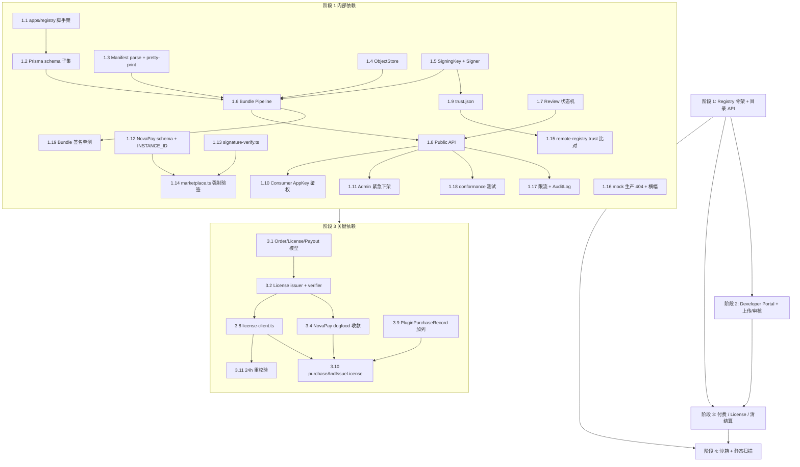

# Implementation Plan

## Overview

本任务清单按设计文档「Phased Rollout」中的四个阶段组织：阶段 1 搭建独立 Registry 服务骨架与目录 API（替代 mock，FREE 插件可用），阶段 2 完成 Developer Portal 与上传/审核闭环，阶段 3 接入付费 / License 校验 / 清结算，阶段 4 收紧沙箱与静态扫描。每个阶段下分别归类到 Registry 端、NovaPay 主程序端、跨切面（审计 / 限流 / 测试）。

每条任务后跟一行 `_Requirements: ..._`，对应 `requirements.md` 中的需求 ID，便于追溯。

## Tasks

## 阶段 1：Registry 服务骨架 + 目录 API（替代 mock，FREE 插件可用）

### Registry 端

- [x] 1.1 在 monorepo 中初始化 `apps/registry/` 子目录的 Next.js + Prisma + TypeScript 工程骨架（`apps/registry/package.json`、`next.config.ts`、`tsconfig.json`、`prisma/schema.prisma` 占位、`README.md`），并接入仓库根 lint / format 配置
  _Requirements: 25.1, 25.3_
- [x] 1.2 在 `apps/registry/prisma/schema.prisma` 中编写阶段 1 子集 Prisma schema：`Developer`、`PluginRecord`、`PluginVersion`、`PluginAsset`、`SigningKey`、`ReviewWorkflow`、`AuditLog`、`RegistryConsumer`，并生成首个 `prisma migrate` 迁移
  _Requirements: 1.1, 6.5, 17.1, 19.1, 25.1_
- [x] 1.3 实现共享 Manifest 模块：解析器 `apps/registry/lib/manifest/parse.ts`（与 `lib/plugins/local-package-manifests.ts` 中 `parsePluginPackageManifest` 字段集合 / 校验规则等价）+ Pretty-Printer `apps/registry/lib/manifest/pretty-print.ts`（保证 round-trip，原始 JSON 副本写回 metadata）
  _Requirements: 6.2, 6.3, 6.4, 24.1, 24.2, 24.3_
- [x] 1.4 实现对象存储封装 `apps/registry/lib/storage/object-store.ts`（S3 兼容；以 sha256 内容哈希作为 key 的一部分；预签名下载 URL 默认 5 分钟有效）
  _Requirements: 6.5, 6.6, 17.3, 17.4_
- [x] 1.5 实现 SigningKey 存取 `apps/registry/lib/signing/key-store.ts` 与 KMS 封装的 Ed25519 签名器 `apps/registry/lib/signing/signer.ts`，支持 ACTIVE / RETIRED 状态
  _Requirements: 19.1, 19.2, 19.3_
- [x] 1.6 实现 Bundle Pipeline `apps/registry/lib/bundle/extract.ts` + `apps/registry/lib/bundle/pipeline.ts`：解包 → sha256 → 对象存储写入（同 sha256 复用 PluginAsset）→ Ed25519 签名 → 创建 `PluginVersion`（state=DRAFT），并在新版本时强制 SemVer 严格递增、`latestVersion` 更新
  _Requirements: 6.1, 6.5, 6.6, 6.7, 6.8, 6.9, 6.10, 6.11_
- [x] 1.7 实现 Review 状态机 `apps/registry/lib/review/state-machine.ts`，对 `DRAFT → SUBMITTED → IN_REVIEW → APPROVED → PUBLISHED`、`IN_REVIEW → REJECTED`、`PUBLISHED → TAKEN_DOWN` 进行白名单校验，非法迁移抛 `ReviewStateMachineViolation`
  _Requirements: 1.1, 1.2, 1.3, 1.4, 1.5, 1.6, 1.7, 1.8, 1.9_
- [x] 1.8 实现 Public API 三个端点：`GET /registry/plugins`（响应字段集合与 `app/api/mock-plugin-registry/registry/plugins/route.ts` 形态逐字段一致，新增信息归入 `metadata.*`）、`GET /registry/plugins/:slug`（含 PUBLISHED 版本列表）、`GET /registry/packages/:slug/:version`（带 5 分钟短期签名 URL + checksum + signature + signatureKeyId）
  _Requirements: 1.10, 11.3, 12.1, 17.1, 17.2, 17.3, 17.4, 23.1, 23.2, 25.2, 25.3_
- [x] 1.9 实现 `GET /.well-known/trust.json`（`apps/registry/app/api/.well-known/trust.json/route.ts`），暴露 `currentKey` 与 `previousKeys[]`（保留至少 30 天）
  _Requirements: 19.2, 19.3_
- [x] 1.10 实现 RegistryConsumer 鉴权中间件 `apps/registry/lib/auth/consumer-app-key.ts`：校验 `x-novapay-registry-app-id` / `x-novapay-registry-app-key`，appKey 不匹配返回 401 / `INVALID_REGISTRY_APP_KEY`，且响应体不含 plugin 数据
  _Requirements: 17.5, 17.6, 17.7_
- [x] 1.11 实现最小 Registry Admin 工作台与紧急下架闭环：路由 `apps/registry/app/(admin)/review-queue/page.tsx` + `apps/registry/app/(admin)/plugins/[slug]/page.tsx`，以及 `POST /admin/plugins/:slug/take-down`（5 秒内 `visible=false`、再提交版本返回 `RECORD_TAKEN_DOWN`）
  _Requirements: 1.3, 1.4, 1.5, 1.7, 3.1, 3.2, 3.4_

### NovaPay 主程序端

- [x] 1.12 在 `prisma/schema.prisma` 上扩展 `PluginRegistrySource`，新增 `trustPublicKey`、`trustPublicKeyKeyId`、`trustPublicKeyExpiresAt`、`licensePublicKey` 列，生成 `prisma/migrations/<ts>_plugin_marketplace_extensions/migration.sql`，并新增 `SystemConfig.INSTANCE_ID` 引导（缺失时启动期生成 `inst_<uuid>` 一次性写入，后续只读）
  _Requirements: 10.1, 10.4, 13.1, 17.5, 23.1_
- [x] 1.13 新增 `lib/plugins/signature-verify.ts`：基于 `node:crypto` 的 Ed25519 验签工具，输入 `(rawBytes, signature, publicKey)`，失败返回结构化错误码
  _Requirements: 12.2, 19.4, 19.5_
- [x] 1.14 改造 `lib/plugins/marketplace.ts` 中的 `installRemoteMarketplacePluginPackage`：对 `REMOTE_SIGNED` 强制 sha256 + Ed25519 签名校验，未提供 checksum 直接拒绝；任一校验失败把 `PluginPackageInstall.status` 写为 `LOAD_ERROR`、`MarketplacePlugin.installed=false`
  _Requirements: 12.1, 12.2, 12.3, 12.4, 19.4, 19.5, 19.6_
- [x] 1.15 在 `lib/plugins/remote-registry.ts` 中接入 `trustPublicKey` 比对：响应携带的 `trust.json` 公钥与 `PluginRegistrySource.trustPublicKey` 不一致返回 `REGISTRY_TRUST_KEY_MISMATCH`，保持 `parseRemotePluginRecord` 既有字段集合与解析逻辑
  _Requirements: 10.4, 10.5, 22.4, 23.1, 23.2_
- [x] 1.16 在 `app/api/mock-plugin-registry/**` 所有 `route.ts` 中加入 `process.env.NODE_ENV === "production"` 时返回 HTTP 404 的生产锁定，并在 `app/admin/(console)/plugins/sources/page.tsx` 增加「当前 Registry 为 mock，仅供开发演示」横幅
  _Requirements: 14.1, 14.2_

### 跨切面（审计 / 限流 / 测试）

- [x] 1.17 实现 Public API 限流中间件 `apps/registry/lib/rate-limit/index.ts` 与审计写入 `apps/registry/lib/audit/log.ts`：按 `x-novapay-instance-id` 默认 600 req/min（超额返回 429 + `Retry-After`），并把发布、下架、密钥读取、trust 不匹配等动作落 `AuditLog`
  _Requirements: 3.2, 17.8, 19.1, 22.3_
- [x] 1.18 编写阶段 1 conformance 测试 `apps/registry/tests/conformance/mock-registry-shape.spec.ts`：把 mock registry JSON 与新 Registry JSON 同时喂入 NovaPay 端 `parseRemotePluginRecord`，断言两侧解析结果字段集合与值等价
  _Requirements: 23.1, 23.2, 25.2, 25.3_
- [x] 1.19 编写 Bundle Signature 单测 `apps/registry/tests/unit/bundle.signature.spec.ts`：覆盖正确签名、错误签名、错误 sha256、被替换字节四种用例
  _Requirements: 19.1, 19.4, 19.5, 19.6_

## 阶段 2：Developer Portal + 上传/审核流（FREE 全闭环）

### Registry 端

- [x] 2.1 实现 Developer 注册 / 登录 / 邮箱验证：`POST /developer/auth/register`（必填 email / password / displayName / contact，初始 `EMAIL_UNVERIFIED`）、`POST /developer/auth/login`、`POST /developer/auth/verify-email`（迁移到 `ACTIVE`），并在 `EMAIL_UNVERIFIED` 时拒绝任何 Plugin_Version 上传
  _Requirements: 5.1, 5.2, 5.3, 5.4_
- [x] 2.2 实现 PAT 管理与鉴权中间件：`POST /developer/tokens` / `DELETE /developer/tokens/:id`（仅落 `tokenHash`），中间件 `apps/registry/lib/auth/developer-pat.ts` 解析 `Authorization: Bearer`、无效或过期返回 401 / `INVALID_TOKEN`
  _Requirements: 9.2, 9.3_
- [x] 2.3 实现 Developer Plugin / Version API：`POST /developer/plugins`、`GET /developer/plugins`、`POST /developer/plugins/:slug/versions`（multipart `package` ≤ 50MB）、`GET /developer/plugins/:slug/versions/:version`、`POST /developer/plugins/:slug/versions/:version/submit`，并在解析阶段对 `UNSUPPORTED_CAPABILITY` / `SLUG_OR_CHANNEL_CONFLICT` 返回结构化错误
  _Requirements: 6.1, 6.2, 6.3, 6.4, 6.8, 6.9, 6.10, 9.1_
- [x] 2.4 实现 Pricing 配置 `PUT /developer/plugins/:slug/pricing`：阶段 2 仅允许 `pricingMode=FREE`，对 `PAID` 字段返回 `PRICE_NOT_ALLOWED_FOR_FREE`，并写入 `PluginPricingHistory`（before/after JSON 快照与时间戳）
  _Requirements: 7.1, 7.4, 7.5, 7.6_
- [x] 2.5 实现安装统计聚合 `GET /developer/plugins/:slug/sales`：按日聚合 distinct NovaPay_Instance 数与启用商户数，仅返回 owner 拥有的 Plugin_Record 数据，否则 403 / `FORBIDDEN_PLUGIN`
  _Requirements: 8.1, 8.3, 8.4_
- [x] 2.6 实现 Categories 与精选：Admin API `GET/POST /admin/categories`、`PUT /admin/categories/:code`（code 全局唯一）、`POST /admin/plugins/:slug/feature`，并在 `GET /registry/plugins` 响应的 `metadata.categories[]` / `metadata.featured` 中暴露
  _Requirements: 2.1, 2.2, 2.3, 2.4, 2.5_
- [x] 2.7 实现 Reject 申诉记录：在 Plugin_Record 已被 take-down 后允许 Developer 创建 `ReviewWorkflow.appealNote` 并通知所有 Registry_Admin
  _Requirements: 1.6, 3.3_
- [x] 2.8 搭建 Developer Portal Web UI：`apps/registry/app/developer/auth/page.tsx`、`plugins/page.tsx`、`plugins/[slug]/page.tsx`、`plugins/[slug]/versions/[version]/page.tsx`、`tokens/page.tsx`、`sales/page.tsx`
  _Requirements: 5.1, 5.3, 8.1, 9.1_

### NovaPay 主程序端

- [x] 2.9 在 `app/admin/(console)/plugins/[slug]/page.tsx` 中按 i18n locale 优先展示 metadata 中的 `displayName / summary / description / categories.displayName`
  _Requirements: 11.2, 11.4_

### 跨切面（审计 / 限流 / 测试）

- [x] 2.10 实现 Developer API 限流（默认 60 req/min/developer，超额 429 + `Retry-After`）并把 Developer 关键动作（创建版本、提交审核、Pricing 变更、PAT 创建/撤销）写入 `AuditLog`
  _Requirements: 7.6, 9.2, 9.4, 9.5_
- [x] 2.11 编写 Developer 上传集成测试 `apps/registry/tests/integration/developer-upload.spec.ts`：覆盖 EMAIL_UNVERIFIED 拒绝、SemVer 倒退、`UNSUPPORTED_CAPABILITY`、`SLUG_OR_CHANNEL_CONFLICT`、超大文件五种用例，以及 Pricing FREE 路径与 `metadata.pricing` 字段一致性
  _Requirements: 5.4, 6.1, 6.3, 6.4, 6.8, 6.9, 7.1, 7.5_

## 阶段 3：付费 / License 校验 / 清结算

### Registry 端

- [x] 3.1 在 `apps/registry/prisma/schema.prisma` 中新增 `Order`、`License`、`LicenseRevocation`、`PayoutAccount`、`PayoutRequest` 模型并生成迁移；`License` 用 partial unique index 处理 `merchantId IS NULL`，并扩展 Pricing 字段以支持 `PAID`（`pricingPlanKind=PER_INSTANCE_ONE_TIME / PER_MERCHANT_SUBSCRIPTION / PER_USAGE`、`priceAmountCents`、`priceCurrency`，本期至少落地前两种）
  _Requirements: 4.1, 7.1, 7.2, 7.3, 13.2, 18.1_
- [x] 3.2 实现 License 签发器与校验器：`apps/registry/lib/licensing/issuer.ts`（用 ACTIVE SigningKey 生成 Ed25519 JWS Compact 写 `License.jwsCompact`、状态 `ISSUED`）+ `apps/registry/lib/licensing/verifier.ts` + `POST /licenses/verify`，覆盖 `SIGNATURE_INVALID / EXPIRED / REVOKED / INSTANCE_MISMATCH / MERCHANT_MISMATCH / SLUG_MISMATCH / VERSION_MISMATCH / UNKNOWN_LICENSE` 全部 reason，P95 ≤ 500ms
  _Requirements: 13.2, 18.1, 18.2, 18.3, 18.4, 18.5, 19.1_
- [x] 3.3 实现 License 撤销 `apps/registry/lib/licensing/revocation.ts` 与对应 Admin API：写 `LicenseRevocation` 并触发 verifier 缓存失效
  _Requirements: 13.8, 18.2_
- [x] 3.4 实现 NovaPay 商户 dogfood 收款集成：客户端 `apps/registry/lib/payments/novapay-client.ts`（通过 NovaPay openapi 创建付费订单、校验签名回调、把 `Order.state` 推进到 `PAID` 并触发 License 签发）+ Public API `POST /registry/plugins/:slug/orders` 与 `GET /registry/orders/:orderId`
  _Requirements: 13.1, 13.2_
- [x] 3.5 实现余额账本与提现：每笔 License 售出后 24 小时内按分成比例计入 `Developer.balanceCents`；`POST /developer/payouts`（提交即冻结、初始 `PENDING_REVIEW`，余额不足返回 `INSUFFICIENT_BALANCE`）；`PayoutAccount` CRUD
  _Requirements: 4.1, 4.2, 4.3, 4.6_
- [x] 3.6 实现 Admin 提现审批 API：`GET /admin/payouts`、`POST /admin/payouts/:id/approve`（扣减余额）、`POST /admin/payouts/:id/reject`（解冻金额）
  _Requirements: 4.4, 4.5_
- [x] 3.7 实现 Signing Key 轮换 `POST /admin/signing-keys/rotate`：新增 ACTIVE key、旧 key 转 RETIRED 并设置 `notAfter = now + 30d`，刷新 `trust.json` 缓存
  _Requirements: 19.2, 19.3_

### NovaPay 主程序端

- [x] 3.8 新增 `lib/plugins/license-client.ts`：导出 `verifyLicense(input)` 与 `revalidateInstalledLicenses()`，封装 `POST /licenses/verify`，并实现 `NOVAPAY_DISABLE_LICENSE_CHECK` 开关（非空时跳过远程调用并 `console.warn`；与 `NODE_ENV=production` 同时存在仍执行真实校验且打印 critical log）
  _Requirements: 13.3, 13.4, 13.7, 13.9, 18.1_
- [x] 3.9 在 `prisma/schema.prisma` 上为 `PluginPurchaseRecord` 增加 `licenseKeyHash`、`licenseExpiresAt`、`verifiedAt` 三列并生成迁移
  _Requirements: 13.6, 23.1_
- [x] 3.10 在 `lib/plugins/marketplace.ts` 中以 `purchaseAndIssueLicense` 取代手动 `recordMarketplacePluginPurchase` 中的 `purchasedAt` 写入：仅当 `verifyLicense` 返回 `valid:true` 才持久化 `PluginPurchaseRecord.licenseKey/licenseKeyHash/licenseExpiresAt/verifiedAt` 与 `MarketplacePlugin.purchasedAt = license.issuedAt`；失败原因写 `notes`
  _Requirements: 13.3, 13.4, 13.5, 13.6_
- [x] 3.11 实现 24 小时 License 重新校验定时任务：调度 `revalidateInstalledLicenses`，REVOKED / EXPIRED 时自动 `MarketplacePlugin.enabled=false` 并保留安装产物以便申诉恢复
  _Requirements: 13.7, 13.8_
- [x] 3.12 在 NovaPay 商户后台安装 MERCHANT-scope 付费插件时调用 `verifyLicense` 时附带 `merchantId`：仅校验通过才创建 `MerchantInstalledPlugin`，对 `MERCHANT_MISMATCH` 返回 HTTP 409 / `LICENSE_ASSIGNED_TO_OTHER_MERCHANT`
  _Requirements: 15.1, 15.3, 15.4_

### 跨切面（审计 / 限流 / 测试）

- [x] 3.13 在 Registry `AuditLog` 与 NovaPay `AdminAuditLog` 中追加 License 签发 / 撤销、提现 approve / reject、SigningKey rotate 事件
  _Requirements: 4.4, 4.5, 13.8, 19.3_
- [x] 3.14 编写 License 签发与校验集成测试 `apps/registry/tests/integration/payments-license-issuance.spec.ts`：覆盖正常签发 → 校验通过、INSTANCE_MISMATCH、MERCHANT_MISMATCH、过期、撤销、未知 license 全部分支，并基准 1000 次 verify P95 ≤ 500ms
  _Requirements: 13.4, 18.2, 18.3, 18.4, 18.5_
- [x] 3.15 编写 NovaPay 端 License 重校验回归测试：模拟 24h 后 REVOKED 返回时 `MarketplacePlugin.enabled` 自动下沉为 false、安装产物保留、`PluginPurchaseRecord.notes` 记录原因
  _Requirements: 13.4, 13.7, 13.8_

## 阶段 4：Sandboxed Runtime + 静态扫描收紧

### Registry 端

- [ ] 4.1 实现静态扫描 worker `apps/registry/workers/static-scan/worker.ts` + 入队 `apps/registry/workers/static-scan/enqueue.ts`：上传成功后异步入队，扫描 `.js / .mjs / .cjs / .ts` 文件 AST
  _Requirements: 20.1_
- [ ] 4.2 实现扫描规则 `apps/registry/lib/static-scan/rules.ts` 与 AST 引擎 `apps/registry/lib/static-scan/ast-scan.ts`：banned API 集合（`child_process.exec/spawn`、`eval`、`new Function` 强制人工复核；`fs.writeFile`、`worker_threads` 警告）+ capability ↔ 代码一致性（声明 `notify_callback` 但未导出 `callbacks`、声明 `refund` 但未实现 `createRefund`）
  _Requirements: 20.1, 20.2, 20.3_
- [ ] 4.3 在 Admin 审核工作台中展示 findings，并在含 BLOCK 严重度时强制路径走 `IN_REVIEW` 人工复核
  _Requirements: 20.2, 20.3_

### NovaPay 主程序端

- [ ] 4.4 新增 `lib/plugins/sandbox-runtime.ts` 与 worker 入口 `lib/plugins/sandbox-worker.ts`：基于 `worker_threads` 实现 `loadSandboxedRuntime`，注入 `hostBridge`（`http / log / time / random`），通过 `resourceLimits.maxOldGenerationSizeMb=128 / maxYoungGenerationSizeMb=16` 设置堆上限；worker 加载插件代码前删除 `globalThis.process / require / Buffer`，对 `child_process` / 嵌套 `worker_threads` / `fs.writeFile` 系列接口的 import 抛 `CAPABILITY_DENIED`
  _Requirements: 16.2, 16.3, 16.5, 21.1, 21.2, 21.3, 21.4_
- [ ] 4.5 实现 capability 白名单运行期校验：未在 manifest 声明的能力（如 `notify_callback`）调用对应 host bridge 时抛 `CAPABILITY_DENIED`；并在 sandbox 加载失败时把 `MarketplacePlugin.metadata.runnable=false`，admin UI 展示「未通过沙箱加载」提示
  _Requirements: 16.2, 21.4, 21.5_
- [ ] 4.6 实现单次 RPC 5 秒超时与 OOM 归一化：每次 host → worker postMessage 配 `setTimeout(5000)` + `worker.terminate()`，超时返回 `PLUGIN_RUNTIME_TIMEOUT`，OOM 错误归一化为 `PLUGIN_RUNTIME_OOM`
  _Requirements: 16.3, 16.4, 16.5_
- [ ] 4.7 改造 `lib/plugins/local-package-runtimes.ts`：当 `manifest.source === "REMOTE_SIGNED"` 时改走 `loadSandboxedRuntime`，其它来源沿用既有 `importLocalRuntimeModule`
  _Requirements: 21.1_
- [ ] 4.8 在 sandbox 中向插件注入按 `merchantId` 过滤后的 `MerchantChannelAccount.config` + 当次请求载荷，禁止跨商户读取
  _Requirements: 16.1_

### 跨切面（审计 / 限流 / 测试）

- [ ] 4.9 编写沙箱隔离集成测试（NovaPay 侧）：覆盖 banned API 抛 `CAPABILITY_DENIED`、5s 超时、128MB 堆 OOM、跨商户读取失败、未声明 capability 抛错五类用例
  _Requirements: 16.1, 16.2, 16.3, 16.4, 16.5, 21.2, 21.3_
- [ ] 4.10 编写静态扫描单测：覆盖 `child_process.exec`、`eval`、`new Function`、capability 不匹配等命中路径以及合法代码不命中路径
  _Requirements: 20.1, 20.2, 20.3_
- [ ] 4.11 在 Registry `AuditLog` 中追加扫描 finding 与 admin 强制复核事件，在 NovaPay `AdminAuditLog` 中追加沙箱拒绝事件，并编写沙箱性能基准（1000 次 createPayment P95 作为后续 hardening 回归门槛）
  _Requirements: 16.2, 20.2, 21.1, 21.3_

## Task Dependency Graph

```json
{
  "waves": [
    {
      "wave": 1,
      "tasks": ["1.1", "1.13", "1.16"]
    },
    {
      "wave": 2,
      "tasks": ["1.2", "1.3", "1.4", "1.5", "1.12"]
    },
    {
      "wave": 3,
      "tasks": ["1.6", "1.7", "1.9", "1.10", "1.15"]
    },
    {
      "wave": 4,
      "tasks": ["1.8", "1.11", "1.14", "1.17", "1.19"]
    },
    {
      "wave": 5,
      "tasks": ["1.18"]
    },
    {
      "wave": 6,
      "tasks": ["2.1", "2.2", "2.6", "2.7", "2.9"]
    },
    {
      "wave": 7,
      "tasks": ["2.3", "2.4", "2.5", "2.8", "2.10"]
    },
    {
      "wave": 8,
      "tasks": ["2.11"]
    },
    {
      "wave": 9,
      "tasks": ["3.1", "3.7", "3.9"]
    },
    {
      "wave": 10,
      "tasks": ["3.2", "3.3", "3.5"]
    },
    {
      "wave": 11,
      "tasks": ["3.4", "3.6", "3.8"]
    },
    {
      "wave": 12,
      "tasks": ["3.10", "3.11", "3.12", "3.13"]
    },
    {
      "wave": 13,
      "tasks": ["3.14", "3.15"]
    },
    {
      "wave": 14,
      "tasks": ["4.1", "4.2", "4.4"]
    },
    {
      "wave": 15,
      "tasks": ["4.3", "4.5", "4.6", "4.8", "4.10"]
    },
    {
      "wave": 16,
      "tasks": ["4.7"]
    },
    {
      "wave": 17,
      "tasks": ["4.9", "4.11"]
    }
  ]
}
```



关键依赖说明：

- 阶段 2、3、4 都依赖阶段 1 的 Registry schema、Bundle Pipeline 与 Public API。
- 阶段 3 的 `purchaseAndIssueLicense`（3.10）必须在 NovaPay `PluginPurchaseRecord` 加列（3.9）和 `license-client.ts`（3.8）之后实施；后两者又依赖 Registry 端 License issuer/verifier（3.2）与 dogfood 收款（3.4）。
- 阶段 4 的沙箱替换（4.7）依赖 4.4–4.6 沙箱实现完成；静态扫描（4.1–4.3）独立于 NovaPay 端，可与沙箱并行推进。

## Notes

- 所有 `_Requirements: ...` 引用均对应 `requirements.md` 中的需求 ID（A. Registry Admin Req 1-4，B. Developer Req 5-9，C. NovaPay Admin Consumer Req 10-14，D. Merchant Consumer Req 15-16，E. Public API Req 17-18，F. 安全与运行时 Req 19-21，G. 迁移 Req 22-25）。
- 阶段 1 的 conformance 测试（任务 1.18）是阶段 1 的"完成定义"门槛：mock registry 与新 Registry 的 JSON 必须能逐字段通过现有 `parseRemotePluginRecord`，否则不能进入阶段 2。
- 阶段 4 的沙箱接入（任务 4.7）建议先以 feature flag `NOVAPAY_PLUGIN_SANDBOX_ENABLED` 控制，灰度通过后再删除 flag；这是沙箱回退路径。
- 所有 Registry 端文件路径以 `apps/registry/` 为根；NovaPay 主程序路径保持现有仓库根。
